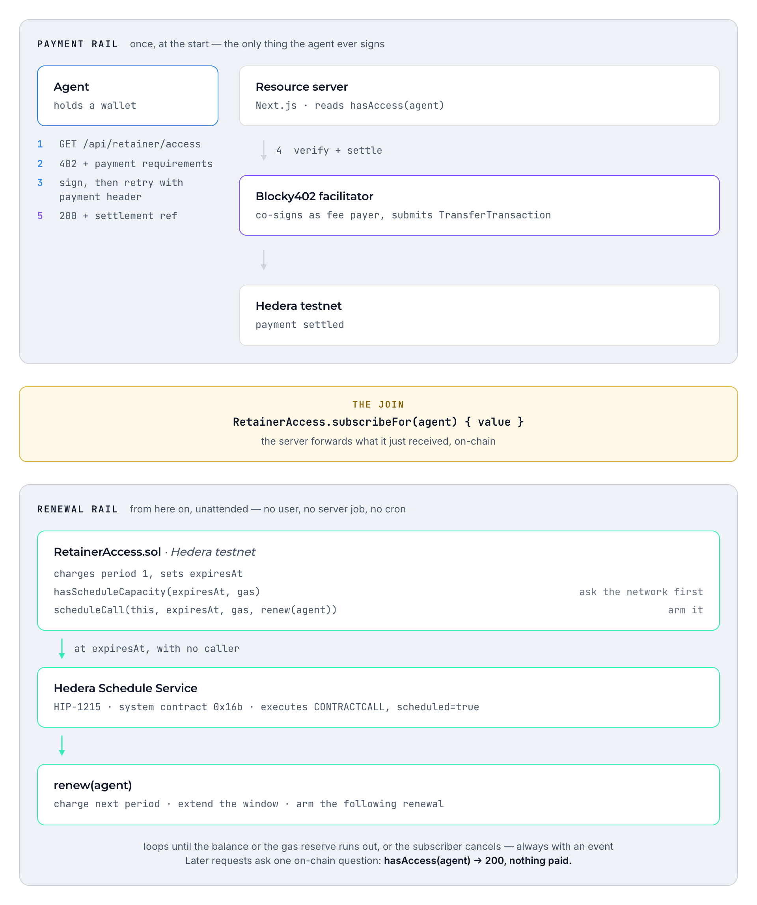

<div align="center">


<h1>Retainer 🔁</h1>

<p><em>Your agent's access renews itself on-chain at 3am, with nobody awake.</em></p>

<p align="center">
  
</p>

<p>An x402-gated resource on Hedera whose access window is an on-chain subscription that the
Hedera Schedule Service extends by itself.</p>

<br/>

[](https://retainer.edycu.dev)
[](https://hashscan.io/testnet/contract/0.0.10415845)
[](https://ethglobal.com/events/ethonline2026)
[](https://retainer.edycu.dev/judge)
[](https://retainer.edycu.dev/pitch-deck.html)

<br/>


[](https://opensource.org/licenses/MIT)
[](https://github.com/edycutjong/retainer/releases/latest)

[](https://github.com/edycutjong/retainer/actions/workflows/lint.yaml)
[](https://github.com/edycutjong/retainer/actions/workflows/e2e.yaml)
[](https://github.com/edycutjong/retainer/actions/workflows/codeql.yaml)
[](https://github.com/edycutjong/retainer/actions/workflows/gitleaks.yaml)
[](https://github.com/edycutjong/retainer/actions/workflows/deploy.yaml)
[](https://github.com/edycutjong/retainer/actions/workflows/release.yaml)

</div>

---

**Live:** <https://retainer.edycu.dev> · **judging this?** the 30-second read is at
<https://retainer.edycu.dev/judge> ([`JUDGE.md`](JUDGE.md)) — claim, four commands that
prove it against Hedera, the measured costs, and the limitations. Or try the gate yourself:

```bash
# a cold agent is charged
curl -i "https://retainer.edycu.dev/api/retainer/access?agent=0x0000000000000000000000000000000000000abc"
# → 402, with an x402 challenge for hedera:testnet settled by Blocky402

# read any agent's window without touching the payment path
curl -s "https://retainer.edycu.dev/api/retainer/status?agent=0xD14CA86A1483e9b2147a7B86fB74D437d3d2Cc66"
```

## 💡 The Problem & Solution

### The Problem

An agent can pay for a thing. An agent cannot *subscribe* to a thing, because every renewal
needs somebody awake to re-authorise it — a human clicking, or a cron job someone has to
operate and keep alive. Retainer removes that person.

### The Solution — what actually happens

A walkthrough you can follow against the running server. The agent's address is passed as
`?agent=0x…`; the only thing it ever signs is the payment in step 2.

**1 — cold request, no access**

```
GET /api/retainer/access?agent=0xAGENT
→ 402  Payment Required
```

The route reads `hasAccess(agent)` on-chain, gets `false`, and builds x402 payment
requirements: `scheme: exact`, `network: hedera:testnet`, asset native HBAR, amount
`RETAINER_PRICE_TINYBAR × RETAINER_PERIODS_PER_PURCHASE`. The challenge body is emitted
verbatim in the `PAYMENT-REQUIRED` header so ordinary x402 clients can parse it.

**2 — the agent pays once**

The agent signs a Hedera `TransferTransaction` under the x402 `exact` scheme and retries with
the payment header. The resource server verifies and settles through the hosted **Blocky402**
facilitator (`https://api.testnet.blocky402.com`), which co-signs as fee payer and submits to
consensus. Nothing is served until funds are actually captured.

**3 — the settled payment becomes on-chain state**

This is the join between the two rails. The server takes the amount it just received and
calls `RetainerAccess.subscribeFor(agent)` with it. That opens the subscription, charges
period one, and **arms the first scheduled renewal**. The response carries both transactions:

```jsonc
{
  "access": "granted",
  "paidThisRequest": true,
  "payment":      { "transaction": "0.0.…@…", "payer": "0.0.…" },
  "subscription": { "opened": true, "transaction": "0x…", "periodsPurchased": 3 }
}
```

If settlement succeeds but the on-chain forward fails, the request is still served and
`subscription.opened` is `false` with the error — the route never implies a subscription that
does not exist.

**4 — the second request, inside the window**

```
GET /api/retainer/access?agent=0xAGENT
→ 200  { "paidThisRequest": false, … }
```

No 402, no signature, no payment. The gate asked the chain one question and the answer was yes.

**5 — a request after the window has expired**

```
GET /api/retainer/access?agent=0xAGENT
→ 200  { "paidThisRequest": false, … }
```

Still 200. Nothing was paid, nobody was awake, no cron job ran. Between step 4 and step 5 the
Hedera Schedule Service called `renew()` on the contract, which charged the next period and
extended the window. One x402 payment buys `RETAINER_PERIODS_PER_PURCHASE` periods (default
3): the first is charged when the subscription opens, the rest are charged by unattended
renewals.

`GET /api/retainer/status?agent=0x…` is the read-only version of the same state — it touches
the chain and nothing else, so a UI can poll it without repeatedly opening payment challenges.
The page at `/` uses it to show the window counting down and then jumping back up on its own.

## 🏗️ Architecture & Tech Stack

Two rails. The payment rail is off-chain HTTP that settles on Hedera; the renewal rail is
purely on-chain. They join in exactly one place: `subscribeFor()`.

<p align="center">
  <picture>
    <source media="(prefers-color-scheme: dark)" srcset="docs/architecture-dark.png">
    <source media="(prefers-color-scheme: light)" srcset="docs/architecture-light.png">
    
  </picture>
</p>

<details>
<summary>Same diagram as plain text</summary>

```
  PAYMENT RAIL (once, at the start)
  ─────────────────────────────────
   Agent ──1─ GET /api/retainer/access ─────▶ Resource server (Next.js)
         ◀─2─ 402 + payment requirements          │ reads hasAccess(agent)
         ──3─ sign Hedera "exact" transfer        │
         ──4─ retry with payment header ─────────▶│
                                                  │ 5 verify + settle
                                                  ▼
                                       Blocky402 facilitator (hosted)
                                                  │ co-signs as fee payer,
                                                  │ submits TransferTransaction
                                                  ▼
                                           Hedera testnet
         ◀─6─ 200 + settlement reference ─────────┘

                    ── THE JOIN ──
      the server forwards what it received on-chain:
         RetainerAccess.subscribeFor(agent) { value }
                          │
                          ▼
  RENEWAL RAIL (from here on, unattended)
  ───────────────────────────────────────
   ┌────────────────────────────────────────────────────────────┐
   │ RetainerAccess.sol            (Hedera testnet)             │
   │   charges period 1, sets expiresAt                         │
   │   hasScheduleCapacity(expiresAt, gas)  ── ask first        │
   │   scheduleCall(this, expiresAt, gas, renew(agent)) ── arm  │
   └───────────────┬────────────────────────────────────────────┘
                   │  at expiresAt, with no caller
                   ▼
        Hedera Schedule Service  (HIP-1215, system contract 0x16b)
                   │  executes CONTRACTCALL, scheduled=true
                   ▼
   ┌────────────────────────────────────────────────────────────┐
   │ renew(agent): charge next period, extend window,           │
   │               arm the following renewal ───────────────────┼──┐
   └────────────────────────────────────────────────────────────┘  │
                   ▲                                               │
                   └───────────────────────────────────────────────┘
                        loops until money or gas reserve runs out,
                        or the subscriber cancels — always with an event

   Later requests ask one on-chain question: hasAccess(agent) → 200, nothing paid.
```

</details>

### Tech stack

| Layer | What |
|---|---|
| Resource server | Next.js 15 (App Router) + TypeScript — `packages/nextjs` |
| Payment | x402 `exact` scheme (`@x402/core`, `@x402/hedera`), settled by the hosted Blocky402 facilitator |
| Contract | Solidity 0.8.28, Hardhat — `packages/hardhat` |
| Self-renewal | Hedera Schedule Service (HIP-1215), system contract `0x16b` |
| Chain | Hedera testnet — JSON-RPC via Hashio, artifacts re-verified against the public mirror node |
| Chain client | ethers v6 |
| Agent interface | OpenAPI 3.1 at [`/openapi.json`](https://retainer.edycu.dev/openapi.json), registered with Bazantic as a gateway and an MCP server |

### What is actually being sold

A subscription to nothing is not a product, so the gated resource is a real metered data feed,
not a constant string.

It serves the **live HBAR/USD rate the Hedera network itself uses**, read from the mirror node
(`/api/v1/network/exchangerate`). That rate is not a third-party quote — it is the number the
network applies when converting its USD-denominated fee schedule into tinybar, which is what
makes Hedera fees predictable and sub-cent. An agent metering this feed is reading the same
number that priced its own transaction.

**The charge is metered, not flat.** A period does not buy unlimited use; it buys a countable
quantity of calls (`callsPerPeriod`). Every served call is counted **on-chain** by
`meter(agent)` before the response goes out, so the tally is auditable by the buyer rather than
asserted by the seller. Spend the allowance and the route answers `429` — the window is still
open, but what the period bought is used up.

And this is where the two halves meet: **the unattended renewal refills the meter.** The same
scheduled call that extends the access window resets `callsUsed` to zero. That is what makes a
self-renewing subscription worth having rather than a novelty.

```jsonc
{
  "access": "granted",
  "paidThisRequest": false,
  "metering": {
    "callsRemainingThisPeriod": 3,
    "recordedOnChain": "0x…"          // one Hedera transaction per served call
  },
  "resource": {
    "pair": "HBAR/USD",
    "rate": 0.08258,
    "raw": { "centEquivalent": 247738, "hbarEquivalent": 30000 },
    "source": "https://testnet.mirrornode.hedera.com/api/v1/network/exchangerate"
  }
}
```

Metering each call on-chain costs one transaction per request, which is only reasonable because
Hedera fees are sub-cent. On a chain with real gas this design would be indefensible, and that
tradeoff is the honest reason it is written this way here rather than kept in a database.

### Money is kept in three pots

`RetainerAccess` never mixes whose money is whose, and `_solvent()` asserts the contract's
balance still covers all three at the end of every call that moves money out of a pot —
`subscribe`/`subscribeFor`, `renew`, `cancel` and `withdraw`:

| Pot | Whose | Spent on |
|---|---|---|
| `_owed` | the subscriber's | drawn down one period at a time; whatever is unspent is refunded on `cancel()` |
| `revenue` | the seller's | withdrawable by `beneficiary` only |
| `gasReserve` | the seller's | the network's fee for each scheduled execution |

Every amount is **tinybar**, and the contract converts nothing. Hedera has two denominations
and the boundary is not where an Ethereum instinct puts it: the JSON-RPC relay speaks
**weibar** (1 HBAR = 1e18), so the `value` you sign is 1e18-scaled, but inside the EVM
`msg.value`, `address(this).balance` and the `value` of an outbound `call{value:}` are all
**tinybar** (1 HBAR = 1e8). The relay converts at the edge. Adding the 1e10 conversion that
Ethereum experience asks for overpays every transfer by ten orders of magnitude, and it still
looks like a successful transaction. This was settled by measurement, not by reasoning:
`packages/hardhat/contracts/test/UnitProbe.sol` was deployed to testnet, sent 2 HBAR as 2e18 on
the wire, and reported `msg.value == 200000000`.

## 🏆 Hedera Schedule Service Integration

Three methods from `HederaScheduleService` (HIP-1215, system contract `0x16b`), all
load-bearing — remove any one and the product breaks rather than degrades:

| Method | Where | What it is for |
|---|---|---|
| `scheduleCall` | `_armRenewal()` | Arms the next renewal: asks the network to call `renew(agent)` on this contract at `expiresAt`. This *is* the product — without it there is only a cron job someone has to run. |
| `hasScheduleCapacity` | `_armRenewal()` | Asked **before** arming. A second with no capacity becomes a clean `Lapsed` event instead of a revert or a subscription that silently stops. |
| `deleteSchedule` | `_releaseSchedule()` | Releases the pending schedule on `cancel()` and returns its held gas to the reserve. Without it, subscribe→cancel churn is a free, repeatable drain of the seller's reserve. |

Two details that only show up on a real network:

- **A scheduled call can see a block timestamp behind its own second.** Observed on testnet
  against contract `0.0.10406002`: the schedule was armed for `expiresAt = 1788779924`, the
  network executed it at consensus `1788779924.038958161`, and `renew()` still reverted with
  `CONTRACT_REVERT_EXECUTED`. A strict `block.timestamp >= expiresAt` gate therefore rejects the
  network's own call and self-renewal silently stops. `renew()` allows `RENEW_SLACK = 30`
  seconds of earliness, and `MIN_PERIOD_SECONDS = 61` keeps that tolerance a strict minority
  of every period so `renew()` cannot be looped by a third party at the seller's expense.
- **Lapsing is loud.** `Lapsed` is emitted *before* scheduling, because a scheduled call that
  cannot pay for itself fails with `INSUFFICIENT_PAYER_BALANCE` and emits nothing at all — the
  subscription would otherwise look alive forever while being dead.

## ⛓️ Live Deployment — proof on Hedera testnet

There are three deployments on testnet, and they are not interchangeable:

| | Contract | What it is |
|---|---|---|
| **Current** | `0.0.10415845` / `0x433050c9bd203FBdd49FAB6b5E20eD3E1FB2a931` · [HashScan](https://hashscan.io/testnet/contract/0.0.10415845) | `RetainerAccess.sol` as it stands in this repo (`7400cd7`). It is what `packages/nextjs/contracts/deployedContracts.ts` points at, so it is the contract the resource server talks to. **29 unattended renewals**, one full lapse cycle, and one scheduled execution that reverted (below). |
| Intermediate | `0.0.10414167` / `0xd3A218AD4c817B14Cc754e4c996A95435155a27B` · [HashScan](https://hashscan.io/testnet/contract/0.0.10414167) | The units-corrected source before metering (`9eb39e3`). **7 unattended renewals**, one `cancel()` that deleted a pending schedule, and the agent-script transcript at the end of `docs/proof.md`. |
| **First** | `0.0.10406083` / `0x8B42a662b0Bd5EecF09517840f63A61AAbEb952A` · [HashScan](https://hashscan.io/testnet/contract/0.0.10406083) | The deployment that produced the cost table below. It predates the current constructor and ABI, so do not read it as a copy of the current source. **3 unattended renewals.** |

**39 renewals the network executed by itself**, across the three — every one a `CONTRACTCALL`
with `scheduled=true` and `SUCCESS`, each with a `Renewed` event; the count and the commands
that reproduce it are in [`docs/proof.md`](docs/proof.md). On the current deployment the loop
ran eight times in a row on 2026-09-08 with no submitter, from one ordinary `renew()` to a loud
`Lapsed`, and reproduced the cost split below at the current gas price: 154,036,168 tinybar for
a renewal that re-arms, 5,222,880 for the one that does not. All eight come back from a single
mirror-node request:

```bash
curl -s "https://testnet.mirrornode.hedera.com/api/v1/transactions/0.0.7314364-1788844238-651641588" \
  | jq -r '.transactions[] | [.consensus_timestamp, .name, "scheduled=\(.scheduled)", .result, "fee=\(.charged_tx_fee)"] | @tsv'
```

One scheduled execution on the current deployment **reverted** — `1788840415.078121802`,
`CONTRACT_REVERT_EXECUTED`, with the contract's own `Insolvent()` guard, while the account held
239 million tinybar more than its three pots. It is the third of the honest limitations in
[`JUDGE.md`](JUDGE.md) and is worked through in `docs/proof.md`; it is not fixed here.

**An x402 payment settled through Blocky402** (the one that opened the current deployment's
subscription, 3 ℏ agent → seller, fee paid by the facilitator):
[`0.0.7162784@1788840225.936068496`](https://hashscan.io/testnet/transaction/1788840233.455239257) —
and the first run's: [`0.0.7162784@1788780154.225876092`](https://hashscan.io/testnet/transaction/1788780164.857913104)

**The three renewals the first deployment's run produced**, all `CONTRACTCALL` with
`scheduled=true` and status `SUCCESS`, read back from the mirror node. No transaction was sent
to trigger any of them:

| Consensus timestamp | Charged to the contract | What happened |
|---|---|---|
| [`1788780226.016366208`](https://hashscan.io/testnet/transaction/1788780226.016366208) | 154,896,000 tinybar = **1.54896 ℏ** | renewed **and** re-armed the next |
| [`1788780286.019735208`](https://hashscan.io/testnet/transaction/1788780286.019735208) | 154,896,000 tinybar = **1.54896 ℏ** | renewed **and** re-armed the next |
| [`1788780346.345418842`](https://hashscan.io/testnet/transaction/1788780346.345418842) | 5,067,825 tinybar = **0.0507 ℏ** | charged the last period, then found nothing left for a fifth: emitted `Lapsed("balance will not cover the next period")` and did **not** re-arm |

Gas used on testnet: `subscribe()` **1,582,554** (limit 2,000,000), deploy **968,564**.

## 🔌 The API as MCP tools — and an agent that checks the claim

`packages/nextjs/public/openapi.json` is served live at
<https://retainer.edycu.dev/openapi.json>. It exists so the gate is callable by something that
has never read this repository: registering that document with **Bazantic** produces an HTTP
gateway and, from the same document, an MCP server. The tool descriptions an agent reads are
this repo's own OpenAPI `description` strings, verbatim — the spec is the interface, and nothing
is written twice.

**Gateway 1 — `https://retainer-x402.bazgateway.com`**, registered from the live OpenAPI
document and published to Bazantic's marketplace, where it currently sits in *pending
verification*. It is priced per method, which is where the product's own asymmetry shows up
again: `/api/retainer/access` costs 1000 millicents ($0.01) and `/api/retainer/status` is 0,
because reading the chain is free and being served is not. Its generated MCP server exposes
four tools — `getAccess`, `getStatus`, `info`, `externalDocs`.

**Gateway 2 — `https://hedera-scheduled-proof.bazgateway.com`**, a one-endpoint slice of
Hedera's Mirror Node REST API exposing two tools, `findScheduledExecutions` and `info`. It is
deliberately
**not** published: the API behind it is Hedera's, not ours, and listing someone else's public
API on a marketplace under our name is not ours to do.

The reason to have both is the recipe that binds them. **"Verify self-renewing agent access on
Hedera"** calls `getStatus` from the first gateway and `findScheduledExecutions` from the
second: it reads the seller's own claim about a subscription, then goes to the ledger and
checks whether the renewal that claim rests on was actually executed by Hedera's scheduler.
That is the trust argument of this project run by a machine instead of a reader — the vendor
asserts, the network confirms. Its saved run returned:

```jsonc
{
  "verification_result": "verified",
  "access_status": true,
  "scheduled_renewals_found": 8
}
```

whose newest scheduled `CONTRACTCALL` at that moment was consensus `1788941916.005290514`. The
count of 8 is what the tool saw in its window — it reads the ten newest transactions by default,
not the contract's whole history.

### The endpoint that structurally cannot see a self-renewal

Building that recipe surfaced a finding worth carrying, because it can catch anyone auditing a
HIP-1215 contract: **`/api/v1/contracts/{id}/results` does not return scheduled executions.** It
lists calls that arrived as an `EthereumTransaction`, and a renewal the Schedule Service
executes never was one. The scheduled renewal at consensus `1788940215.030907876` was absent from
that endpoint's twenty newest results when this was measured on 2026-09-09, and is plainly
present here as `CONTRACTCALL` with `scheduled: true`:

```bash
curl -s "https://testnet.mirrornode.hedera.com/api/v1/transactions?account.id=0.0.10415845&transactiontype=CONTRACTCALL&order=desc" \
  | jq -r '.transactions[] | [.consensus_timestamp, .name, "scheduled=\(.scheduled)", .result] | @tsv'
```

The first version of the recipe queried the contract-results endpoint, reported that no
scheduled renewals were found, and looked entirely correct while doing it — a verifier pointed
at the one endpoint that cannot see the thing being verified. Read the account's transactions,
not the contract's results.

## 📊 Engineering Rigor — gas economics, the honest part

The third row of the renewals table above is the whole cost story, and it is the most
interesting thing this build measured. A renewal that re-arms the next one costs
**1.54896 HBAR**. A renewal that does not re-arm costs **0.0507 HBAR**. That is a **~30×** gap
between two executions of the same function, and it means:

> Re-arming the next renewal — the `scheduleCall` into `0x16b` — is roughly **97%** of what a
> renewal costs. The renewal's own bookkeeping is the cheap 0.05 HBAR part.

The local Hardhat gas report, which mocks the scheduler and therefore excludes the
system-contract call, puts `renew()` at **48,247–77,085** gas and `subscribe()` at
**137,552–205,722**. The ~1.4M difference against testnet *is* the real `scheduleCall`. If you
only ever measure locally, you will not see the cost of this product at all.

It gets worse before it gets better: **Hedera refunds at most 20% of an unused gas limit**, so
`RENEWAL_GAS_LIMIT = 2_500_000` is charged at roughly 2,000,000 gas whether or not it is used.

**The consequence, stated plainly: at the default price of 1 HBAR per period, Retainer loses
money on every renewal**, because each renewal burns ~1.55 HBAR of the *seller's* gas reserve
to collect 1 HBAR of revenue. `RENEWAL_COST_ESTIMATE` (2 HBAR) is held out of the reserve per
armed renewal for exactly this reason, and `renewalsRemaining()` reports how many the reserve
can still afford.

This is the real constraint of on-chain self-renewal, and it is not solved here. Two things
move it:

1. **Right-size `RENEWAL_GAS_LIMIT`** toward the ~1.5M actually used. Recovers roughly a third.
2. **Price a period above the renewal cost.** This is what actually makes it solvent, and it
   is a product decision, not a code one: break-even is the ~1.55 HBAR a re-arming renewal
   actually costs, and the reserve drains at the 2 HBAR `RENEWAL_COST_ESTIMATE` the contract
   holds back per armed renewal. Below that, the seller is paying for its own users.

The full measurement — how Hedera charges a scheduled call, what the 1.549-vs-0.051 split
proves, and each option sized honestly — is in [`docs/gas-economics.md`](docs/gas-economics.md).
Every transaction, schedule and event behind the table above, with `curl` commands that
re-verify all of it against the public mirror node, is in [`docs/proof.md`](docs/proof.md).

A subscription therefore ends loudly rather than silently. Renewal stops with a `Lapsed` event
carrying its own reason string — `"balance will not cover the next period"`,
`"gas reserve will not cover the next renewal"`, `"no schedule capacity at that second"`,
`"network refused the schedule"`, or the defensive `"insufficient subscriber balance"` — and
the first four are asserted by name in the test suite. A subscriber who cancels is a separate
event, `Cancelled`: an ending they chose, not one that surprised them.

What a lapse does **not** do is restart. Once `active` goes false the contract cannot re-arm
itself, and the two obvious ways to try both fail:

| Attempt | What actually happens |
|---|---|
| `renew(agent)` | reverts `NotSubscribed()` — the guard is the first line of the function. `eth_call` against `0x4330…a931` for a lapsed agent returns `0x237e6c28`, that error's selector |
| `fund()` | credits the subscriber's balance and emits `Funded`. It arms nothing: `_armRenewal` is reached only from `_subscribe` and from a successful `renew` |

The way back is to open a subscription again — `subscribe()`, or the `subscribeFor()` the
resource server calls when the agent pays the next 402. So the unattended part of this product
runs exactly as far as the money does: until the subscriber's balance or the seller's gas
reserve runs dry, and no further. Nothing on-chain is holding a wake-up call after a lapse, so
the restart has to come from outside — the agent paying again, or the seller topping up
`fundGasReserve()`, which nothing in the contract does on its own. That boundary is easy to
miss at the demo settings on the current deployment: 90-second periods against a reserve that
holds back 2 ℏ per armed renewal, so a funded Retainer burns down in minutes rather than months.

## 🚀 Getting Started

No Docker, no object storage, no self-hosted facilitator. Settlement uses the hosted Blocky402
testnet facilitator, which supplies its own fee payer.

### Prerequisites

Node.js ≥ 20.18.3 (Node 20 LTS), Yarn 3 via Corepack
(`corepack enable && corepack prepare yarn@stable --activate`), and a funded **ECDSA** Hedera
testnet account from the [Hedera Portal](https://portal.hedera.com/) faucet. ECDSA is required
— x402 on Hedera will not work with an ED25519 key.

### Installation

```bash
git clone https://github.com/edycutjong/retainer.git
cd retainer
yarn install
```

### 1. Contract keys and compile

```bash
cp packages/hardhat/.env.example packages/hardhat/.env
yarn hardhat:account:generate      # or: yarn hardhat:account:import
yarn hardhat:compile
yarn hardhat:test
```

Fund the printed deployer account with testnet HBAR before deploying.

### 2. Deploy `RetainerAccess`

```bash
RETAINER_PRICE_TINYBAR=100000000 \
RETAINER_PERIOD_SECONDS=3600 \
yarn hardhat:deploy --network hederaTestnet
```

After deploying, the script seeds the gas reserve with **8 HBAR** (`RETAINER_RESERVE_HBAR`) in a
separate `fundGasReserve()` call — not as constructor value, because Hedera credits a
contract-create's initial balance outside the EVM frame, where a payable constructor cannot book
it. A self-renewing contract has to hold gas for its own future; at the 2 HBAR
`RENEWAL_COST_ESTIMATE` the contract holds back per armed renewal, 8 HBAR arms four of them.
The script writes the address and native `0.0.x` contract id into
`packages/nextjs/contracts/deployedContracts.ts`, which the resource server reads
automatically.

### 3. Resource server

```bash
cp packages/nextjs/.env.example packages/nextjs/.env
```

Set these (the rest of the file has sensible defaults):

| Variable | What it is |
|---|---|
| `HEDERA_RPC_URL` | JSON-RPC endpoint. Defaults to `https://testnet.hashio.io/api`. |
| `FACILITATOR_URL` | `https://api.testnet.blocky402.com`. Already the code default. |
| `RETAINER_PAY_TO` | The seller's Hedera account id (`0.0.x`) that x402 payments go to. |
| `RETAINER_PRICE_TINYBAR` | Price of one period. Default `100000000` (1 HBAR). Must match the contract's terms. |
| `RETAINER_PERIODS_PER_PURCHASE` | How many periods one payment buys. Default `3`. |
| `RETAINER_SERVER_KEY` | ECDSA key of the seller account that forwards settled payments on-chain. Without it the 402 still settles but no subscription opens. |
| `RETAINER_ACCESS_ADDRESS` | Optional override; normally resolved from `deployedContracts.ts`. |

Then:

```bash
yarn next:dev
```

- `http://localhost:3000` — the landing page and live view. The instrument at the top replays
  the recorded testnet run (four real transactions from `docs/proof.md`, labelled as recorded, 10×
  time) or watches any agent live; paste an address and the window counts down and then extends
  itself. Every live number is read from chain state via `/api/retainer/status`; nothing is simulated.
- `http://localhost:3000/api/retainer/access?agent=0x…` — the gate.
- `http://localhost:3000/api/retainer/status?agent=0x…` — read-only state, safe to poll.
- `http://localhost:3000/judge` — the judge-facing summary. Static, no auth, no chain call, so
  it renders even when the network does not.

### 4. Run the agent end to end

`packages/nextjs/scripts/retainer-agent.ts` is the demo as an agent experiences it: cold
request → 402 → pay via x402 → the server forwards that settled payment into `subscribeFor` →
the same request again, now 200 with `paidThisRequest:false` → wait past expiry sending
nothing → 200 again. It reads `BUYER_PRIVATE_KEY`, `BUYER_ACCOUNT_ID` and
`RETAINER_ACCESS_ADDRESS` from `~/.config/retainer/hedera.env` (credentials live outside the
repo):

```bash
cd packages/nextjs
BASE_URL=http://localhost:3000 yarn tsx scripts/retainer-agent.ts
```

If `RETAINER_SERVER_KEY` is not configured the server cannot forward the payment, so the
script opens the subscription itself with the agent's own key and says so — the rest of the
run is unchanged. It waits the seller's own `periodSeconds` (plus 45s of slack) unless
`PERIOD_SECONDS` overrides it.

`packages/hardhat/scripts/proveRenewal.ts` is the narrower proof that produced the testnet
measurements above: it reads the seller's terms off the contract, subscribes for three
periods, then *sends nothing* and re-reads `subscriptionOf` to show the window extended on its
own. It then cancels and compares the refund against the wallet balance, which is the
regression guard for the tinybar/weibar bug.

## 🧪 Testing & CI

```bash
yarn hardhat:test
```

**46 passing** in `packages/hardhat/test/RetainerAccess.test.ts`, grouped by the thing each
group protects: tinybar/weibar unit handling, the seller — not the subscriber — setting the
price, x402 settlement crediting the on-chain subscription, the `renew()` time gate that
closes the griefing vector, what the contract actually asks the scheduler to do, separation of
the three money pots, metering, lapsing loudly in every failure case, and the access gate
itself. `MockScheduleService.sol` stands in for the `0x16b` system contract locally — which is
exactly why local gas numbers understate the real cost, as measured above.

Test names describe the defect they pin rather than the function they call, so the list reads
as a changelog of the bugs this build actually had — *"accepts a renewal that fires slightly
EARLY, as the real scheduler does"* is the testnet observation above, turned into a guard.
Six of them are permission-boundary tests: the beneficiary cannot reach subscriber money or
the gas reserve, a stranger cannot loop `renew()`, and `subscribeFor` cannot spend an agent's
balance without funding a period. Each claim is listed next to its test in
[`.github/SECURITY.md`](.github/SECURITY.md).

```bash
yarn next:test        # 10 unit tests, the resource server's arithmetic
```

The sharpest edge in this project — Hedera's weibar/tinybar boundary, whose failure mode is a
transfer wrong by ten orders of magnitude that still returns a successful receipt — cannot be
guarded by examples, because examples are exactly what a 1e10 error survives. So the
conversion is verified across a range instead: **202,059 distinct amounts** against three
invariants each (606,177 assertions) — every value from 0 to 100,000, every value across the
1 HBAR seam, every decade edge up to 1e18 including the 1e10 factor itself, and 100,000
randomised uint64 amounts. The oracle is the `UnitProbe` measurement from testnet, not a
restatement of the implementation. See [`docs/hedera-units.md`](docs/hedera-units.md).

```bash
yarn e2e              # 56 Playwright checks, no credentials required
```

The E2E suite asserts the one thing a paywall must never do. With no seller account
configured, `/api/retainer/access` is sent a cold agent and the answer **must not be 200** —
402, 500, 502 and 503 are all correct refusals; a served feed is not. That the suite needs no
credentials is a property of the *tests*, not of the product: Retainer has no offline or mock
mode, and the paid path is proven against the live network in
[`docs/proof.md`](docs/proof.md). It found two real layout bugs on `/judge` the first time it
ran, both at 375px, both invisible from a desktop. `e2e/landing.spec.ts` pins what a judge relies
on at `/`: one claim, the instrument in the first viewport, the recorded run labelled as recorded,
an explicit switch to the live chain, no autoplay under reduced motion, no sideways scroll on a phone.

### The harness

| Layer | Tool | Where |
|---|---|---|
| Contract tests | Hardhat + Mocha, 46 passing | `.github/workflows/lint.yaml` |
| Unit tests | Vitest + fast-check, 10 passing, 202,059 amounts | `.github/workflows/lint.yaml` |
| E2E | Playwright, 56 checks, desktop + mobile | `.github/workflows/e2e.yaml` |
| Types + lint | `tsc --noEmit` and ESLint, both workspaces | `.github/workflows/lint.yaml` |
| SAST | CodeQL — TypeScript **and** the Actions workflows | `.github/workflows/codeql.yaml` |
| Secrets | gitleaks over the **full history**, `fetch-depth: 0` | `.github/workflows/gitleaks.yaml` |
| Dependencies | Dependabot, grouped and monthly, majors ignored | `.github/dependabot.yml` |
| Performance | Lighthouse CI + a bundle-size tripwire | `.github/workflows/e2e.yaml` |
| Deploy gate | verify → Vercel → **live 402 smoke test** | `.github/workflows/deploy.yaml` |

The deploy workflow is the one worth a second look: it refuses to promote a build whose live
gate has stopped answering `402` for `hedera:testnet`. A green deploy badge here means the
product still works, not that Vercel accepted an upload.

CodeQL deliberately does not claim to cover the Solidity — there is no CodeQL extractor for
it, and a green checkmark that means nothing is worse than an absent one. The contract's
security properties are asserted by named tests instead.

`yarn ci` runs the compile, both test suites, both lints and both type checks in one command.

## 📁 Project Structure

```
packages/hardhat/
  contracts/RetainerAccess.sol          the subscription + self-renewal contract
  contracts/test/MockScheduleService.sol local stand-in for system contract 0x16b
  contracts/test/UnitProbe.sol          the tinybar/weibar measurement, run on testnet
  deploy/01_deploy_retainer_access.ts   deploys, then funds the gas reserve
  scripts/proveRenewal.ts               subscribe, send nothing, watch it renew
  test/RetainerAccess.test.ts           46 tests

packages/nextjs/
  app/api/retainer/access/route.ts      the x402 gate: 402, settle, subscribeFor
  app/api/retainer/status/route.ts      read-only chain state, safe to poll
  app/page.tsx                          the landing page and live view
  components/landing/                   the instrument: recorded run (from docs/proof.md) + live chain
  services/retainer/server.ts           contract reads + forwarding settled payments
  services/x402/server.ts               x402 resource server, Blocky402 facilitator
  app/judge/page.tsx                    /judge — the 30-second read for one reader
  public/openapi.json                   the OpenAPI 3.1 document the MCP tools are generated from
  test/units.property.test.ts           the unit boundary, 202,059 amounts
  scripts/retainer-agent.ts             the whole flow as an agent runs it

e2e/                                    Playwright: the gate must fail closed
JUDGE.md                                what /judge says, for whoever arrives from GitHub
specs/                                  architecture and provenance
prompts/                                the prompts that directed the build
docs/proof.md                           every on-chain artifact, and how to re-verify it
docs/gas-economics.md                   what an unattended renewal actually costs
docs/hedera-units.md                    the weibar/tinybar trap, and the probe that settled it
.github/SECURITY.md                     each security claim, next to the test that pins it
```

## 📄 License

MIT — see [`LICENCE`](LICENCE). The file retains the original copyright line from the
scaffold-hbar template it was inherited from.

## 🙏 Acknowledgments — provenance

This repository was built from **[hedera-dev/scaffold-hbar](https://github.com/hedera-dev/scaffold-hbar)**,
branch `templates/x402-pay-per-use` — the starter template Hedera's own bounty page lists as
official. Saying so plainly is the point: it is permitted, and hiding it would read far worse.

The template's own product — a MinIO-backed pay-per-download file marketplace with a
`FileRegistry` contract, a block explorer, `docker-compose`, and a self-hosted facilitator —
has been **removed**. What remains from it is the Hedera wallet/RPC plumbing, the Hardhat
setup, and the x402 client/server wiring. `RetainerAccess.sol`, both API routes, the retainer
service layer, the live view, the agent script, and the tests are this project's own.

Full file-by-file accounting, including a correction to an earlier overstatement, is in
[`specs/provenance.md`](specs/provenance.md). AI attribution per file is in
[`AI-USAGE.md`](AI-USAGE.md); the prompts that directed the build are in
[`prompts/`](prompts/).
